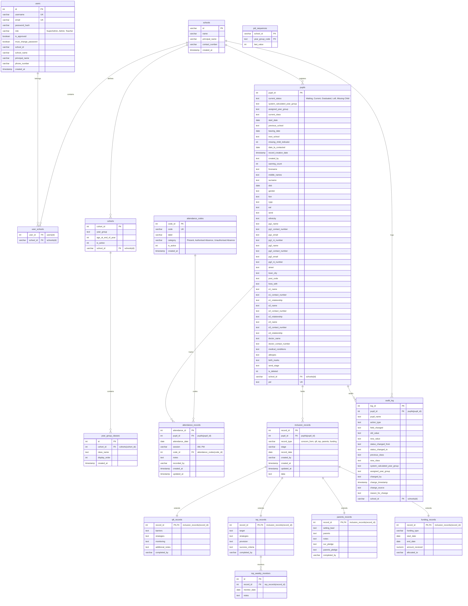

# Database Design Document: School Admission & Student Information System (SIS)

This document provides a detailed layout of the PostgreSQL relational database schema, highlighting entity relationships, fields, data types, constraints, and indexes.

---

## 📊 Entity Relationship Diagram (ERD)

---

## 🔑 Key Tables & Fields

### 1. `users` Table
Stores user account profiles and application security access levels.
*   `role`: Restricts operations based on three levels: `SuperAdmin`, `Admin`, and `Teacher`.
*   `school_id` and `school_name`: Legacy direct fields, migrated to `user_schools` mapping table for supporting multi-school environments.

### 2. `schools` & `user_schools` Tables
Supports multi-school tenancy:
*   `schools` stores global school entities.
*   `user_schools` defines a many-to-many relationship mapping user profiles to their active schools.

### 3. `pupils` Table
Master student details tracking:
*   `current_status`: Check constraint limits status to `'Waiting'`, `'Current'`, `'Graduated'`, `'Left'`, and `'Missing Child'`.
*   `pid`: Standardized Pupil ID (`PID-<SCHOOL>-<YEAR>-<SEQ>`) formatted for displays.
*   `is_deleted`: Flag implementing soft-deletion routines.

### 4. `inclusion_records` (SEND Polymorphism)
Supports polymorphic storage of Special Educational Needs documentation:
*   Extends metadata: `record_type` constraints (`'concern_form'`, `'qft'`, `'iep'`, `'parents'`, `'funding'`).
*   Sub-type records (`qft_records`, `iep_records`, `parents_records`, `funding_records`) share the same `record_id` acting both as Primary Key and Foreign Key to `inclusion_records` (`ON DELETE CASCADE`).

---

## ⚡ Indexing & Performance Strategy
Optimized indexes cover the hot query paths:
1.  **Audit Logs Filtering**:
    *   `idx_audit_log_school_ts` on `(school_id, change_timestamp DESC)` to optimize log dashboards.
2.  **Pupil Lookups**:
    *   `idx_pupils_school_status_class` on `(school_id, current_status, current_class) WHERE is_deleted = 0`.
    *   `idx_pupils_school_year_group` on `(school_id, assigned_year_group) WHERE is_deleted = 0`.
    *   `idx_pupils_pid` on `(pid)` to enable fast ID lookups.
3.  **Attendance Pivot**:
    *   `idx_attendance_records_pupil_date` on `(pupil_id, attendance_date)`.
