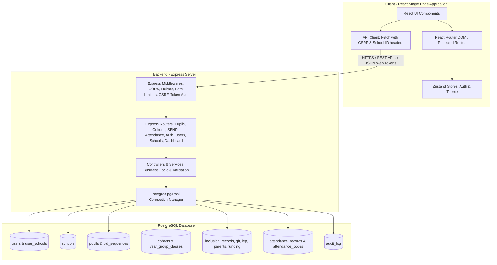

# Project Documentation: School Admission & Student Information System (SIS)

This document provides a detailed overview of the School Admission & Student Information System, detailing its system architecture, folder structure, tech stack, database models, and operations.

## 🏗️ System Architecture & Data Flow

The application is structured as a monorepo consisting of a React client, an Express API server, and a PostgreSQL database.



### Flow Breakdown
1. **User Request**: The React client routes pages through protected or public components depending on authentication states.
2. **API Communication**: The client communicates via fetch endpoints containing the necessary standard headers (`Authorization`, `X-School-ID`, and CSRF protection headers).
3. **API Security**: Request parameters pass through security middlewares (`helmet`, `cors`, rate limiters, token validation) before arriving at functional routes.
4. **Data Management**: Controllers read and write database changes concurrently using standard native SQL statements via a pooled connection manager (`pg`).

---

## 📂 Key Directory Structures

```
.
├── .github/workflows/       # CI/CD deployment pipeline
│   └── deploy.yml           # Automated deployment via SSH to AWS EC2
├── client/                  # Frontend single page application
│   ├── src/
│   │   ├── components/      # UI Layouts, ProtectedRoute, Shared Controls
│   │   ├── hooks/           # custom hooks (e.g. useSessionExpiry)
│   │   ├── lib/             # API client, validation rules, utility functions
│   │   ├── pages/           # Page routes (Auth, Pupil Form, SEND, Attendance, etc.)
│   │   ├── store/           # Zustand state management (authStore, themeStore)
│   │   ├── types/           # TS definitions
│   │   ├── App.tsx          # Router configuration and application layout
│   │   └── main.tsx         # App entrypoint
├── server/                  # Backend Express API Service
│   ├── src/
│   │   ├── controllers/     # Route business logic handlers
│   │   ├── db/              # Database connection and schema migrations
│   │   ├── lib/             # Helper libs (PID generation, default cohorts)
│   │   ├── middleware/      # Auth tokens, CSRF protection, rate limiting
│   │   ├── models/          # Data access queries
│   │   ├── routes/          # Express route registration
│   │   └── index.ts         # Main server startup & middleware initialization
├── deploy.sh                # Automation script running on target server
└── ecosystem.config.cjs     # PM2 Process Manager Configuration
```

---

## 💾 Relational Database Design

Below is a detailed overview of the entity-relationship design for the database schema:

```
                  ┌──────────────────────┐
                  │       schools        │
                  └──────────┬───────────┘
                             │ 1
                             │
                             │ *
   ┌───────────┐ *        * ─┴───────────┐ *         * ┌──────────────┐
   │   users   ├──────────┤ user_schools ├─────────────┤    pupils    │
   └───────────┘          └──────────────┘             └──────┬───────┘
                                                              │ 1
                                                              │
                                       ┌──────────────────────┼──────────────────────┐
                                       │ 1                    │ 1                    │ *
                                       ▼                      ▼                      ▼
                            ┌──────────────────┐    ┌──────────────────┐    ┌──────────────────┐
                            │inclusion_records │    │attendance_records│    │    audit_log     │
                            └──────────┬───────┘    └──────────┬───────┘    └──────────────────┘
                                       │                       │
         ┌─────────────┬───────────────┼───────────────┐       │ *
         ▼             ▼               ▼               ▼       ▼
   ┌───────────┐ ┌───────────┐   ┌───────────┐   ┌───────────┐ │ ┌──────────────────┐
   │    qft    │ │    iep    │   │  parents  │   │  funding  │ └─┤ attendance_codes │
   └───────────┘ └─────┬─────┘   └───────────┘   └───────────┘   └──────────────────┘
                       │ 1
                       ▼
         ┌──────────────────┐
         │iep_weekly_monitor│
         └──────────────────┘
```

- **Authentication & Authorization**: The `users` table holds user account hashes. Role checks enforce logic based on `SuperAdmin`, `Admin`, or `Teacher`. Multiple schools are linked to users through the `user_schools` join table.
- **Pupils Register**: `pupils` represents the master database table for school attendees, mapped to a `school_id`. An independent table, `pid_sequences`, manages localized pupil display identifiers concurrently.
- **Special Educational Needs (SEND)**: The `inclusion_records` table acts as a polymorphic parent model with specialized child records (`qft_records`, `iep_records`, `parents_records`, `funding_records`) linked by foreign key constraints.
- **Attendance Ledger**: Sessions are logged per student in `attendance_records`, joining with active configurations defined within `attendance_codes`.

---

## ⚙️ Development & Deployment

### Local Development Lifecycle
1. Install dependencies from the root directory: `npm install`.
2. Populate `.env` environments in both `/server` and `/client` directories.
3. Start the application servers in development watch mode: `npm run dev`.

### Automated Deployment Cycle
1. Code changes are pushed to `main` branch.
2. The GitHub action triggers an SSH step executing `./deploy.sh`.
3. The server runs clean installations (`npm ci`), compiles frontend/backend builds, moves public client assets to `/var/www/html/` under Nginx, and reloads PM2 instances configured in `ecosystem.config.cjs`.
